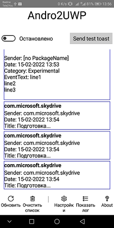
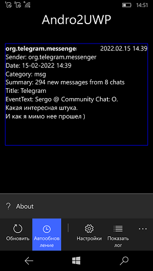

# Andro2UWP 1.0.20-alpha

## Abstract

My attempt to recover PKar70's Andro2UWP project, branch 10.2002.5

- Technical version (build): 1.0.20.0
- Status: alpha (RnD)

## Progress 
- OneDriveUNO created instead of OneDriveA-OneDriveUWP (in progress; file transfer goes with some errors/bugs)
- RU Localization realized 
- Android Sync Engine recovered (partially) 
- Mobile UWP W10M compatibility  
- Real toast notifications constructed + test toast sending added (but not full-tested yet)

## Big problems
- One great problem is still here: the system 15-min task sheduling (op. system timer problems?)
- Android App freeze and UWP W10M background work (timer) freeze :(  

## Idea (Goal)
New solution for whatsapp-telegram-bridge via Android-phone/Win10Mobile phone "interconnect" 

The beginning starts at this discussion: https://forum.xda-developers.com/t/new-solution-for-whatsapp-telegram-bridge.4211421/

## Progress
Phases of "building the solution": 

[1] RnD +- [70%]

[2] Design +- [30%]

[3] Tech. project +- [60%]

[4] Dev >> [60%]

[5] "Intro" - [0%]

## Screenshots

## Description
### Android app
This app takes your Android notifications, and some of them (filtered using rules you set) 
send to your OneDrive (folder: Apps/Andro2UWP). You can view it either as simple text files 
(from any browser, from any device) or using UWP companion app.

It doesn't use any other data, and it doesn't send anything else anywhere else.

### UWP app
This app reads files from your OneDrive (folder: Apps/Andro2UWP), treating it as Android notification sent by Android companion app.

It doesn't use any other data, and only data it send (to same OneDrive folder) are dictionary of renames of notification 
sender names and notification filters, both created by you.

## Requirenments
- Win SDK : 14xxx (min.) and 19041 (recommended)
- Targets: ARM; x86

## My "Workbench" 

Visual Studio 2022

Used Workloads:
- Xamarin
- UNO Platform extesion

# Contribute!
There's still a TON of things missing from this proof-of-concept (MVP) and areas of improvement 
which I just haven't had the time to get to yet:
- UI Improvements (for GTK, for example, or for each one of supported multi-platforms)
- Additional Language Packages
- Media Transferring Support: screenshots, etc. (for the brave)

With best wishes,

  [m][e] 2022

## Thanks!
I wanted to put down some thank you's here for folks/projects/websites 
that were invaluable for helping me get this project into a functional state:
- [Piotr Karocki](https://github.com/pkar70/) - Great C#/Xamarin/UNO Platform developer
- [Andro2UWP](https://github.com/pkar70/Andro2UWP) - Original Andro2UWP

## License & Copyright

Andro2UWP 1 is RnD project only. AS-IS. No support. Distributed under the MIT License.  

